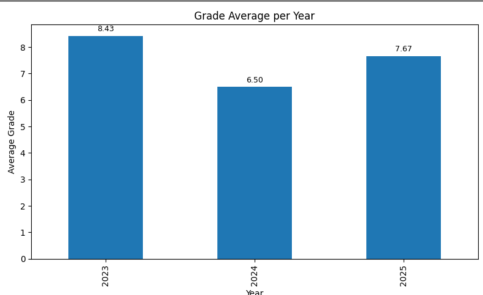
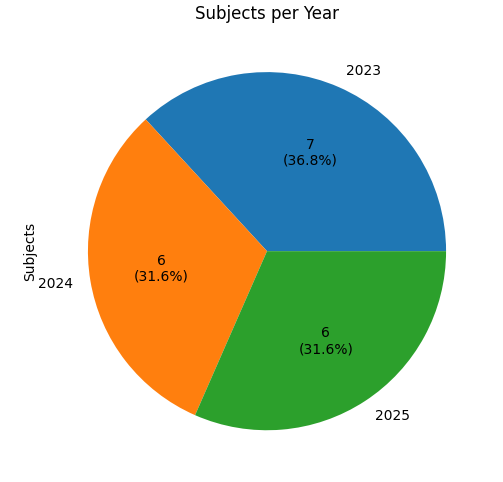

# Academic Progress Visualizer

This project helps you analyze and visualize your academic performance over time. By loading your grade data from a JSON file, it calculates the average grade and the number of subjects passed per year, and then displays this information through intuitive charts.

## Features

- Calculate average grades per year
- Count the number of subjects passed each year
- Display a bar chart of average grades with annotated values
- Display a pie chart showing the distribution of subjects passed per year
- Easy to update by providing your academic data in JSON format

## Usage

1. Prepare academic data as a JSON file (`data.json`) with the following structure:

    ```json
    {
      "data": [
        {
          "Codigo": "03624",
          "Materia": "INTRODUCCION A LOS SISTEMAS DE INFORMACION",
          "Fecha": "2023-07-17",
          "Nota": "8"
        },
        ...
      ]
    }
    ```

2. Run the Python script to load the data and generate the graphs.

3. View the generated charts displaying your academic progress visually.

## Example Graphs

### Average Grade per Year



### Subjects Passed per Year



## Requirements

- Python 3.x
- pandas
- matplotlib

Install dependencies via:

```bash
pip install pandas matplotlib
